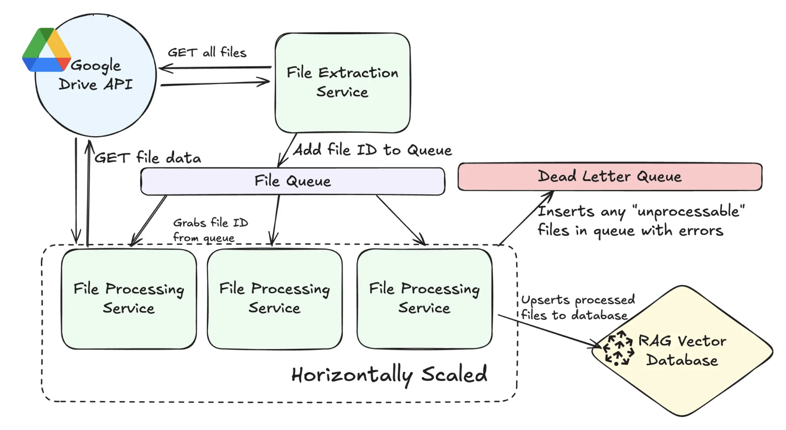

# Hướng dẫn sử dụng RAG (Retrieval-Augmented Generation)

Việc sử dụng RAG để hỗ trợ chuyển giao kiến thức (knowledge transfer) cho thành viên mới hoặc khi có sự thay đổi nhân sự (swap resource) trong một dự án là rất hiệu quả. Dưới đây là hướng dẫn cụ thể từng bước:

## 🔍 1. RAG là gì (Hiểu nhanh)?
**RAG = Retrieval (Tìm kiếm) + Generation (Sinh văn bản)**

Kết hợp khả năng tìm kiếm dữ liệu (vd: tài liệu cũ, wiki, confluence, Jira...) và tạo câu trả lời chính xác, có dẫn chứng cho các câu hỏi của thành viên mới.

## 🧠 2. Mục tiêu khi dùng RAG cho onboarding hoặc resource swap
- Tự động trả lời các câu hỏi từ thành viên mới: “Hệ thống này hoạt động ra sao?”, “API nào dùng để tạo user?”, “Service A liên kết với B thế nào?”
- Giảm thời gian đào tạo và phụ thuộc vào người cũ.
- Hỗ trợ tra cứu tài liệu nhanh chóng, có ngữ cảnh.

## 🛠️ 3. Cách triển khai RAG cho việc chuyển giao dự án




### Bước 1: Chuẩn bị dữ liệu (Corpus)
Tập hợp tài liệu liên quan đến dự án:
- **Tài liệu business**: mô tả nghiệp vụ, quy trình, mục tiêu dự án.
- **Tài liệu hệ thống**: kiến trúc hệ thống, API docs, database schema, luồng xử lý...
- **Nguồn**: Google Docs, Confluence, Notion, PDF, Jira, Slack export...

### Bước 2: Tiền xử lý dữ liệu
- Tách đoạn tài liệu theo logic (theo mục, theo file).
- Loại bỏ thông tin nhạy cảm.
- Chuyển đổi định dạng thành plain text hoặc markdown để dễ vector hóa.

### Bước 3: Indexing bằng Vector Store
- Dùng thư viện như **LangChain**, **Haystack**, hoặc **LlamaIndex**.
- Tạo Embedding từ tài liệu bằng mô hình như **OpenAI Embedding**, **Cohere**, hoặc **Instructor XL**.
- Lưu vào vector database như **FAISS**, **Weaviate**, **Pinecone**, hoặc **ChromaDB**.

### Bước 4: Triển khai RAG bot
1. **Câu hỏi từ người dùng** → Embedding → Tìm đoạn liên quan từ vector store.
2. **Ghép vào prompt** → Đưa vào LLM (ChatGPT, Claude, Mistral...) để trả lời.

## 🧪 4. Kịch bản sử dụng thực tế
**Ví dụ**: Thành viên mới hỏi  
*"Dữ liệu người dùng được lưu ở đâu và backup như thế nào?"*

RAG bot sẽ:
1. Tìm đoạn tài liệu liên quan từ tài liệu hệ thống (DynamoDB schema, Backup policy).
2. Tạo câu trả lời:  
   *“Dữ liệu người dùng được lưu trong bảng Users của DynamoDB. Hệ thống có thiết lập backup theo thời gian thực thông qua Point-in-Time Recovery (PITR)...”*

## ✅ 5. Ưu điểm khi dùng RAG cho onboarding
- Tiết kiệm rất nhiều thời gian đào tạo.
- Thành viên mới tự tra cứu mà không cần hỏi thủ công.
- Nội dung luôn nhất quán vì lấy từ nguồn chuẩn.
- Quản lý kiến thức linh hoạt cho cả business lẫn technical.

## 🧰 Công cụ gợi ý

| **Mục đích**       | **Công cụ**                     |
|---------------------|---------------------------------|
| Tạo vector          | LangChain, LlamaIndex          |
| Embedding           | OpenAI, Germini            |
| Vector DB           | FAISS, Redis, ...      |
| UI bot              | Streamlit, ChatbotUI, Slackbot |


# POC

# 🤔 Agentic RAG với Gemini Flash Thinking

Hệ thống RAG Agentic được xây dựng với mô hình Gemini 2.0 Flash Thinking mới và gemini-exp-1206, Qdrant để lưu trữ vector, và Agno (trước đây là phidata) để điều phối agent. Ứng dụng này có các tính năng như viết lại truy vấn thông minh, xử lý tài liệu, và dự phòng tìm kiếm web để cung cấp các câu trả lời AI toàn diện.

## Tính năng

- **Xử lý tài liệu**
  - Tải lên và xử lý tài liệu PDF
  - Trích xuất nội dung từ trang web
  - Tự động chia nhỏ văn bản và tạo embedding
  - Lưu trữ vector trong Qdrant cloud

- **Truy vấn thông minh**
  - Viết lại truy vấn để cải thiện tìm kiếm
  - Truy xuất tài liệu dựa trên RAG
  - Tìm kiếm tương đồng với lọc ngưỡng
  - Dự phòng tự động sang tìm kiếm web
  - Ghi nguồn cho câu trả lời

- **Khả năng nâng cao**
  - Tích hợp tìm kiếm web Exa AI
  - Lọc theo miền tùy chỉnh cho tìm kiếm web
  - Tạo phản hồi có ngữ cảnh
  - Quản lý lịch sử trò chuyện
  - Agent viết lại truy vấn

- **Tính năng mô hình cụ thể**
  - Gemini Thinking 2.0 Flash cho trò chuyện và lập luận
  - Mô hình Gemini Embedding để tạo vector embeddings
  - Khung Agno Agent để điều phối
  - Giao diện tương tác dựa trên Streamlit

## Cài đặt

### 1. Google API Key
1. Truy cập [Google AI Studio](https://aistudio.google.com/apikey)
2. Đăng ký hoặc đăng nhập tài khoản
3. Tạo một API key mới

### 2. Thiết lập Qdrant Cloud
1. Truy cập [Qdrant Cloud](https://cloud.qdrant.io/)
2. Tạo tài khoản hoặc đăng nhập
3. Tạo một cluster mới
4. Lấy thông tin xác thực:
   - Qdrant API Key: Tìm trong mục API Keys
   - Qdrant URL: URL cluster của bạn (định dạng: `https://xxx-xxx.cloud.qdrant.io`)

### 3. Exa AI API Key (Tùy chọn)
1. Truy cập [Exa AI](https://exa.ai)
2. Đăng ký tài khoản
3. Tạo API key để sử dụng tính năng tìm kiếm web

## Cách chạy

1. Cài đặt các phụ thuộc:
```bash
pip install -r requirements.txt
```

2. Chạy ứng dụng:
```bash
streamlit run agentic_rag_gemini.py
```

## Sử dụng

1. Cấu hình API key trong sidebar:
   - Nhập Google API key
   - Thêm thông tin xác thực Qdrant
   - (Tùy chọn) Thêm Exa AI key để tìm kiếm web

2. Tải tài liệu:
   - Sử dụng trình tải file cho PDF
   - Nhập URL để lấy nội dung web

3. Đặt câu hỏi:
   - Nhập truy vấn trong giao diện chat
   - Xem truy vấn đã được viết lại và nguồn
   - Xem kết quả tìm kiếm web khi cần

4. Quản lý phiên làm việc:
   - Xóa lịch sử trò chuyện khi cần
   - Cấu hình miền tìm kiếm web
   - Theo dõi tài liệu đã xử lý
## DEMO
Load 1 vài document cơ bản của project ( nếu môi trường thực tế thì có thể load tất cả tài liệu của project lên vector db )

- 📄 [SCA] wiki.pdf
- 📄 [SCA] DIVVY UP_画面定義書_Screen Spec - 画面一覧_Screen list.pdf
- 📄 [SCA] DIVVY UP_画面定義書_Screen Spec - [ULO_01]ログイン（Login）.pdf
- 📄 [SCA] DIVVY UP- - Function list - System admin.pdf
- 📄 [SCA] DIVVY UP- - Function list - Business admin.pdf
- 📄 [SCA] DIVVY UP- Function list - User App.pdf
- 📄 [SCA] DIVVY UP_画面定義書_Screen Spec - [USI_01]会員登録（Register）.pdf
- 📄 [SCA] DIVVY UP - Technical Stack.pdf
- 📄 [SCA] Message List - Mail template.pdf
- 📄 [SCA] DIVVY UP_画面定義書_Screen Spec - [UEV_01] 予定追加(Add Event).pdf

<video src="./rag-divvy-up.webm" width="640" height="480" controls></video>


## TODO
- Tích hợp với Google Spreadsheet để quản lý tài liệu bằng webhook của Google API
- Tích hợp với Slack
- Triển khai trên AWS
- Extract image to text upload to Vector DB
- Import Figma to Vector DB
- Hoặc Có thể sử dụng n8n để tự động hóa quy trình này